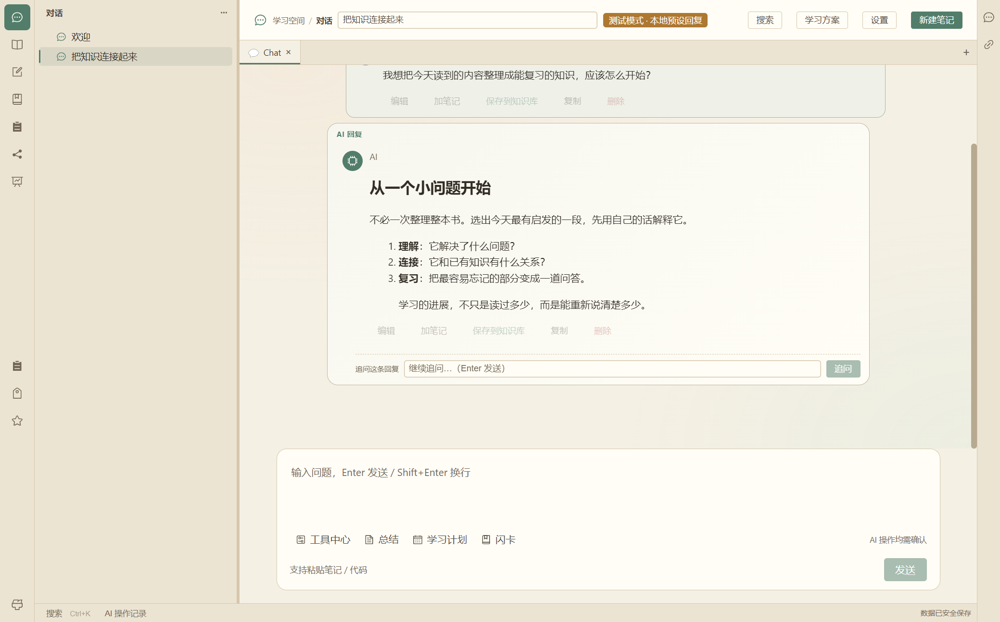
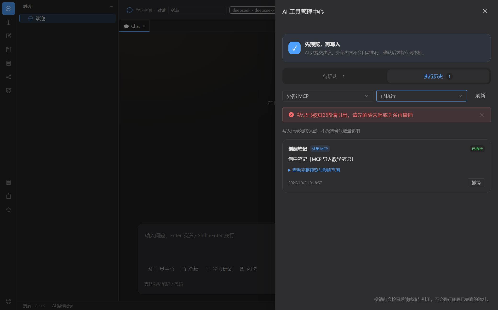
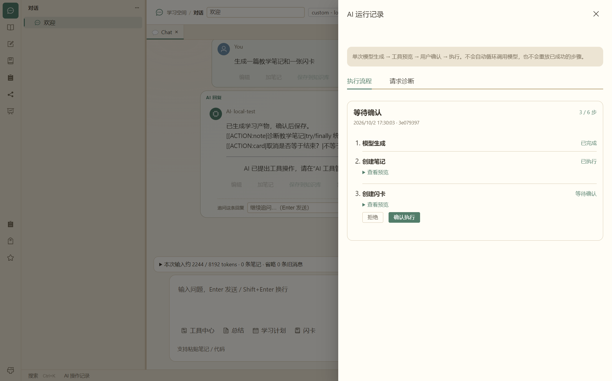

# Learning Kit

一个本地优先的 Windows AI 学习工作台，把 **阅读 → 笔记 → AI 辅助整理 → 间隔复习** 串成一个学习流程。

使用 Electron、Vue 3 和 TypeScript 构建；资料在本地管理，云端 AI 按用户配置调用。不同学习需求可以使用不同的对话 Prompt，AI 生成的学习条目经预览、确认后保存。

> 当前状态：`0.1.0` 预发布版本。项目正在进行产品收敛，建议重要资料保留独立备份，不要把它作为唯一副本。

## 界面预览



*2026-09-12 界面演示，使用隔离测试资料和预置回答，不代表真实云端模型效果。截图早于对话级 Prompt 按钮加入。*

## 主要能力

- 护眼双页笔记：文本、公式、表格、图片、画笔、目录和位置链接。
- PDF / EPUB 阅读：目录、页码跳转、书签、划线、批注、便签和关联笔记。
- AI 对话：流式回答与中途停止、对话轮次折叠、层级整理和本地测试模式。
- 对话独立 Prompt：继承全局、本对话专属、不追加自定义三种模式；提供可编辑的编程导师、阅读理解、英语陪练和写作润色模板。
- 知识图谱（新增）：知识点、四类有向关系、来源证据、搜索缩放与手动关系管理；支持选定笔记的 AI 提取预览，确认后事务保存。
- 可控上下文：对话历史、笔记上下文、学习统计和工具提案可开关；支持输入预算、历史裁剪及可选的本地笔记关键词检索。
- 知识管理：全局搜索、标签、内容块、双向链接和历史版本。
- 学习复习：闪卡、间隔重复、来源回链和学习统计。
- AI 工具：将结构化输出映射为笔记、闪卡、知识点、习题集或 Draw.io 图表等提案，经预览、确认后执行；支持的操作可在工具中心撤销。
- 工具中心：待确认与执行历史独立分页，支持来源/状态筛选、折叠全文、批量确认和撤销二次确认；后续引用、属性或版本阻止破坏性撤销。
- 请求诊断与 Agent 流程：主聊天展示请求耗时、首次内容、失败分类与服务商实际用量；可选的有界执行流程支持逐项确认、失败重新预览、步骤预算与重启恢复。
- 界面设置：分类设置面板、多主题、搜索与工具中心快捷入口。

离线 OCR、习题集与 AI 图表映射仍需持续验证；已接入本机 stdio MCP 导入服务，协议客户端与确认/恢复自动化测试通过，外部 AI 宿主配置和人工验收仍待验证。

### 外部 AI 导入 / MCP Server

先运行 `npm run build`（开发时至少运行 `npm run build:mcp`），打开应用，在“设置 → 外部 AI / MCP”开启服务，点击“复制客户端配置”，粘贴到支持 stdio MCP 的客户端配置中。外部客户端需安装 Node.js 24+，并保持桌面应用运行；路径变化或凭据轮换后需重新复制配置。配置含访问密钥，请勿公开或提交到 Git。无需安装 Java、Python 或原生编译工具。

提供 `learning_kit_status`、`import_note`、`import_knowledge_point`、`import_status` 四个工具。例如 `import_note` 参数：

```json
{"requestKey":"java-ipc-20261002-01","title":"IPC 与职责隔离","body":"主进程负责验证和本地保存，渲染进程负责展示与用户确认。"}
```

知识点参数为 `requestKey`、`title`、`description`。相同 key/内容重试返回原操作的最新状态；相同 key 不同内容拒绝，跨重启仍防重。新标题不超过 300 字符，笔记正文不超过 30000 字符，知识点描述不超过 10000 字符；待确认外部导入最多 100 项，超过需先处理队列。

创建、重试和状态查询返回紧凑回执：`operationId`、`status`、`preview`（操作标签）、`affected` 和可选 `error`，不重复回传正文。完整内容仍保存在应用内提案预览。知识点新建按标题去除两端空白并忽略大小写去重，不自动合并同名知识；确认时会再次校验，避免重复提案先后写入。

返回 `pending_confirmation` **不代表保存成功**。在底部“AI 操作记录”打开工具中心，检查带“外部 MCP”标记的全文预览，手动勾选后确认或拒绝；确认后的条目进入笔记/知识库，可从执行记录安全撤销。知识点导入不自动建立图谱关系。外部客户端用返回的 `operationId` 查询状态，没有批准、删除、覆盖、任意 SQL 或本地文件访问工具。

工具中心默认不勾选任何提案，只处理本页选择；历史在查询阶段排除待确认项，再按每页 12 项展示，不会被大量排队记录遮住。撤销保留快照校验，并检查图谱来源/关系、链接、子条目和来源内容块；新建笔记已有属性或历史版本也会拒绝删除，不级联清理后来产生的数据。追加撤销对引用保守保护，失败后操作保持“已执行”，可处理引用后重试。



*2026-10-02，真实 Electron 窗口、隔离测试资料。界面和标准协议自动联调，不代表真实外部模型回答效果。*

服务默认关闭，开关立即生效，关闭保留待确认项；轮换密钥撤销旧配置。Windows named pipe 和随机凭据用于鉴权，不开放 HTTP 端口，不宣称 SID 专属 ACL；同用户恶意进程或管理员不属于可隔离的威胁范围。桥接不直接访问数据库、不调用模型，因而不额外消耗 Token；外部 AI 模型本身按其服务计费。

验证：`npm run test:ui:mcp`，开发模式复用测试：构建桥接后 `node tests/mcp-import.e2e.cjs --dev`。截图使用隔离测试资料、标准 SDK 客户端，不代表真实外部模型联调。

## AI 如何配置

1. 打开“设置”，选择 DeepSeek、OpenAI、阿里 DashScope 或自定义 OpenAI 兼容接口，填写模型与自己的 API Key。
2. 在连接设置中测试连接；需要真实模型回答时，关闭本地测试模式。
3. 在上下文设置中选择允许发送的内容、输入预算，以及是否开启笔记检索。
4. 在“回答偏好”中设置全局自定义 Prompt；也可打开某个对话顶部的“Prompt”按钮，为该对话单独配置。

专属 Prompt 替代全局自定义部分，不替换内置规则；保存后影响后续回答，不清空已有历史。笔记 AI 和复习分析仍使用全局配置。

### 请求诊断与 Agent 流程

在“设置 → 上下文与隐私”中选择“请求诊断”“请求服务商返回用量”和“Agent 执行流程”，在主聊天顶部打开“运行记录”。诊断默认开启，保存最近 200 条本地元数据，不额外保存 API Key、对话正文或原始错误；服务商未提供用量时显示未知，不用上下文估算冒充计费。include_usage 请求参数默认关闭，不兼容的自定义服务保持关闭即可；模型返回的 usage 仍会被解析。

Agent 默认关闭，第一版是一次模型生成后的确认式流程，不是自主循环或自动规划。默认最多 6 步，可设为 2–20 步，模型生成、每项工具和每次失败重试分别占一步；超限整批不创建提案。工具失败可“重新预览”，必须再次确认；已成功步骤不重放。执行流程恢复最近 40 条显示记录，待确认工具也可从原工具中心处理。关闭应用中断的模型请求不自动重发。

2026-10-02：类型检查、逻辑回归、构建以及隔离 Electron 本地模拟 SSE 的主聊天、预览、确认、停止、用量、步骤上限和重启测试通过。真实云端与开发模式人工验收仍待进行；界面截图的用量来自模拟服务，不代表真实账单。



### 知识图谱使用

在“知识库 → 知识图谱”中新建知识点、编辑关系，或选择“从笔记提取”。明确选定一篇笔记后，点击“发送笔记并提取”才调用模型；可停止请求、编辑候选 JSON，再“校验并预览 → 确认保存图谱”。同名唯一节点复用，保留原描述；来源在确认前变化会拒绝保存。

节点和关系附带连续原文证据，可回到来源笔记核对。原文存在不代表模型判断正确，关系仍需人工审核。手工关系可不附原文。当前提取最多 20 个节点、40 条关系，笔记上限 12000 字符，仍受输入预算限制；画布最多展示 60 个节点、150 条关系，可搜索缩小范围。

“设置 → 上下文与隐私 → 图谱增强检索”默认关闭，仅影响主聊天。开启后按问题中的完整知识点标题命中种子并扩展一跳，将有效来源笔记及路径加入上下文；过期、删除的来源不会发送。与普通检索共用最多 4 条摘录和输入预算，无向量模型、实体消歧模型或多跳推理，不宣称完整 GraphRAG。

图谱验证（2026-09-15）：类型检查、生产构建、逻辑回归以及隔离 Electron + 本地模拟 AI 的提取/确认/取消/关系编辑/重启测试通过。真实云端提取质量和开发模式人工 smoke 尚未验收。

知识点和图表等 AI 输出不是直接写库的命令：先生成工具提案，再由用户检查并确认。云端调用需要联网，可能产生服务商费用；本地测试模式仅用于体验预置流程。

## 工程实现

- **进程隔离**：渲染层经 preload 的类型化 `window.lk` 接口调用主进程；开启 `contextIsolation`，关闭 `nodeIntegration`。
- **本地持久化**：sql.js（SQLite WASM），写入节流与关闭保存握手，避免引入需要 native build 的数据库包。
- **流式生命周期**：处理分块 SSE、UTF-8 边界、取消和异常，配有回归测试。
- **上下文控制**：保留当前问题与系统规则，在预算内选择历史和检索片段；展示来源与裁剪信息。
- **工具输入校验**：学习条目先校验再生成提案；Draw.io XML 使用受限结构验证，不直接信任模型输出。
- **工具状态收敛**：共享工具元信息、Pinia 工具中心状态模块与分页 IPC；事件合并刷新，序号阻止旧响应覆盖新状态，主进程继续独立校验来源和权限。

检索目前采用关键词匹配，不是向量语义检索；输入预算使用字符启发式估算，不是服务商的精确 token 或计费结果。

## 技术栈

- Electron 32 + electron-vite 2
- Vue 3 + TypeScript + Pinia + Element Plus
- Tiptap、PDF.js、EPUB.js、KaTeX、Tesseract.js
- sql.js 本地数据库
- OpenAI 兼容 AI 接口

## 本地运行

### 环境要求

- Windows 10 / 11
- Node.js 24 LTS；`.node-version` 是本地开发与 CI 的共同版本基线，`package.json` 声明最低 Node.js 24
- npm

### 安装与启动

```powershell
git clone https://github.com/kitegs/learning-kit.git
cd learning-kit
npm ci --no-audit --no-fund
npm run dev
```

当前尚未提供正式安装包，需要从源码运行。

## 验证

```powershell
npm run typecheck
npm test
npm run build
```

Electron UI 回归（使用隔离临时资料，不使用日常资料库）：

```powershell
npm run test:ui:notebook-anchor
npm run test:ui:database-recovery
npm run test:ui:pdf-reader
npm run test:ui:ai-workflow
npm run test:ui:mcp

# 以下测试需先 npm run build
node tests/ai-settings.e2e.cjs
node tests/conversation-prompt.e2e.cjs
node tests/ui-polish.e2e.cjs
node tests/knowledge-graph.e2e.cjs
```

CI 在 Windows 上执行依赖安装、类型检查、全部逻辑测试和构建，通过后分别运行笔记锚点、AI 工作流和 MCP 导入的隔离 Electron 回归。AI 回归使用本地模拟 SSE，不消耗真实模型 token；UI 失败时尽力采集截图和脱敏诊断，保留 7 天。支持手动触发，并取消同一分支/PR 的过期运行。尚未配置安装包自动发布（CD）。

验证记录：2026-09-13 类型检查、`npm test` 和生产构建通过；2026-09-12 已运行新增 AI 设置、界面与对话 Prompt 的隔离 Electron 测试。真实云端流式/停止/连接测试与开发模式人工 smoke 尚未完成整体验收。构建仍有 Sass API、Rollup 注释等警告。

## 代码结构

```text
electron/main/       主进程：数据库、AI 请求、检索、工具与文件服务
electron/preload/    window.lk IPC 桥接
electron/shared/     前后端共用的对话 Prompt 校验
src/components/     编辑器、输入框、工具预览等组件
src/views/          聊天、阅读器、笔记、知识库、复习和设置
src/stores/         Pinia 状态管理
tests/              逻辑回归与真实 Electron UI 测试
docs/               需求、技术方案、业务决策和验证记录
```

## 本地数据与隐私

- 笔记、图书索引、对话和复习数据保存在 Electron `app.getPath('userData')/data/` 下，不写入仓库。
- API Key 在系统支持时通过 Electron `safeStorage` 加密保存。
- AI 请求会发送给用户在设置中选择的服务商；本项目不提供中转服务器。
- “本地优先”不等于 AI 全程离线：问题、提示词与启用的历史/上下文/检索片段会随请求发送。请勿把敏感资料加入不可信服务商的请求。
- 上传日志或提交 Issue 前，请删除 API Key、书籍内容、个人笔记和数据库文件。

## 已知限制

- 目前仅以 Windows 为目标平台。
- 尚无云同步、多人协作、自动更新和正式安装包。
- 笔记分页、PDF 批注、对话折叠等核心流程正在进行稳定性收敛。
- OCR 质量取决于扫描清晰度；高级文字层编辑尚未完成。
- AI Draw.io 映射只接受受限、未压缩的 XML 子集，不保证导入任意 Draw.io 文档。
- 自动化测试不等于生产验证；尚未提供真实用户规模或性能收益的量化结论。

产品收敛范围和验收标准见：

- [产品收敛版本需求](docs/REQ/REQ-20260903-01-product-convergence.md)
- [产品收敛实施方案](docs/DEV/DEV-20260903-01-product-convergence.md)

## 开发约定

修改项目前请阅读 [AGENTS.md](AGENTS.md)。项目禁止引入需要 native build 的依赖；新增 IPC 必须同步主进程、preload 和渲染层类型声明。

## License

[MIT](LICENSE)
